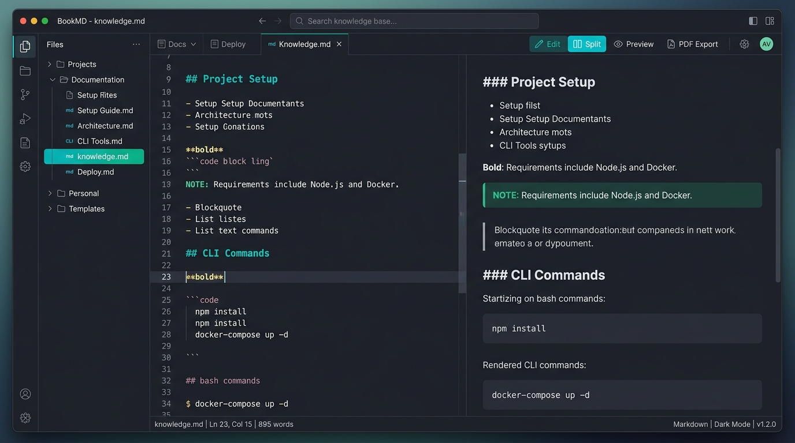

# BookMD

<div align="center">


### Không gian ghi chú Markdown nhẹ, nhanh và ưu tiên filesystem dành cho dân kỹ thuật.

[](https://github.com/Thv0n9K1nG/BookMD/actions/workflows/ci.yml)
[](LICENSE)
[](https://tauri.app/)
[](https://react.dev/)

</div>

---



## 📌 Giới thiệu

**BookMD** được thiết kế riêng cho những trường hợp ghi chú kỹ thuật (technical notes, cheatsheets, tài liệu DevOps/Security/Backend) được chia thành nhiều file Markdown nhỏ trong thư mục, cần tìm kiếm tức thì xuyên suốt workspace, dán ảnh chụp màn hình tự động gom vào thư mục riêng mà vẫn giữ 100% dữ liệu dưới dạng file thông thường trên máy tính.

Không cơ sở dữ liệu bí mật. Không định dạng độc quyền. Không khóa dữ liệu người dùng.

---

## ✨ Tính năng chính

- 📂 **Filesystem-First & Local-First:** Toàn bộ ghi chú là thư mục và file `.md` bình thường trên ổ đĩa. Dễ dàng đồng bộ qua Git, Syncthing, Dropbox hoặc ổ cứng ngoài.
- ⚡ **CodeMirror 6 Editor:** Trình soạn thảo văn bản kỹ thuật mượt mà, hỗ trợ syntax highlighting đa ngôn ngữ, số dòng, tìm kiếm & thay thế.
- 👁️ **Chế độ xem linh hoạt:** Hỗ trợ chuyển đổi nhanh giữa **Editor Only**, **Split View (song song)** và **Preview Only**.
- 🔍 **Tìm kiếm toàn văn siêu tốc:** Tích hợp thuật toán ripgrep trên Rust backend, quét toàn bộ workspace trong vài mili-giây, nhảy trực tiếp đến dòng kết quả.
- 🖼️ **Quản lý hình ảnh tự động:** Dán ảnh trực tiếp từ clipboard (`Ctrl + V`). Ứng dụng tự động lưu vào `assets/images/`, đặt tên theo slug tài liệu, băm SHA-256 chống trùng lặp và chèn link Markdown tương đối.
- 🔄 **Đồng bộ liên kết ảnh:** Tự động phát hiện và cập nhật đường dẫn ảnh trong Markdown khi bạn đổi tên file ghi chú.
- 📄 **Xuất PDF chuẩn kỹ thuật:** Xuất bản ghi chú sang định dạng PDF đẹp mắt, căn chỉnh trang và font chữ code chuẩn xác.
- 📑 **Mục lục tiêu đề (Table of Contents):** Chuyển đổi linh hoạt giữa cây thư mục Workspace và Mục lục (Outline) của tài liệu Markdown đang mở. Tự động bóc tách các cấp độ tiêu đề H1-H6, nhấp chuột để nhảy tức thì đến đúng dòng nội dung.
- 🎨 **Giao diện hiện đại & Command Palette:**
  - `Ctrl + P` / `Ctrl + Shift + P`: Command Palette truy cập nhanh mọi chức năng.
  - `Ctrl + K`: Hộp thoại tìm kiếm workspace.
  - Dark Theme & Light Theme tùy biến.
  - Quản lý nhiều tab tài liệu, lưu tự động, menu chuột phải nhanh.

---

## ⌨️ Phím tắt tiện ích

| Phím tắt | Chức năng |
|---|---|
| `Ctrl + S` | Lưu tài liệu đang mở |
| `Ctrl + B` | Ẩn / Hiện thanh Sidebar |
| `Ctrl + Shift + O` | Chuyển đổi xem Thư mục / Mục lục (Table of Contents) |
| `Ctrl + K` | Mở hộp thoại tìm kiếm Workspace |
| `Ctrl + P` / `Ctrl + Shift + P` | Mở Command Palette |
| `Ctrl + W` | Đóng tab hiện tại |
| `Ctrl + \` | Chuyển chế độ xem (Editor / Split / Preview) |
| `Ctrl + V` (trong Editor) | Dán ảnh từ clipboard và tự động lưu |

---

## 🏗️ Kiến trúc hệ thống

BookMD được xây dựng theo mô hình kiến trúc phân lớp an toàn:

```
┌────────────────────────────────────────────────────────┐
│             Frontend (React 19 + TypeScript)           │
│   CodeMirror 6  │  Markdown-it Preview  │  UI Shell    │
└──────────────────────────┬─────────────────────────────┘
                           │ IPC invoke / events
┌──────────────────────────▼─────────────────────────────┐
│               Backend (Rust + Tauri v2)                │
│  Workspace FS  │  ripgrep search  │  Image Pipeline    │
└──────────────────────────┬─────────────────────────────┘
                           │ File I/O
┌──────────────────────────▼─────────────────────────────┐
│                 Hệ thống tệp (Filesystem)              │
│   notes/ (*.md)  │  assets/images/  │  .bookmd (opt)   │
└────────────────────────────────────────────────────────┘
```

Xem chi tiết tại: [docs/03-architecture.md](docs/03-architecture.md).

---

## 🚀 Cài đặt & Phát triển

### Yêu cầu tiên quyết
- **Node.js** (>= 20.x) và **npm**
- **Rust** (>= 1.80) và **Cargo**
- *Windows:* C++ Build Tools (hoặc Visual Studio với Desktop development with C++)

### Chạy ứng dụng ở môi trường Development

1. **Clone repository:**
   ```bash
   git clone https://github.com/Thv0n9K1nG/BookMD.git
   cd BookMD
   ```

2. **Cài đặt dependencies:**
   ```bash
   npm install
   ```

3. **Chạy giao diện web thử nghiệm (Vite Dev Server):**
   ```bash
   npm run dev
   ```
   Truy cập `http://localhost:1420` để xem giao diện với mock data sẵn có.

4. **Chạy ứng dụng Desktop đầy đủ với Tauri:**
   ```bash
   npm run tauri dev
   ```

### Đóng gói ứng dụng (Build & Packaging)

Để tạo bộ cài đặt cho hệ điều hành của bạn:

```bash
npm run tauri build
```

Các file cài đặt sẽ được tạo ra trong thư mục `src-tauri/target/release/bundle/`:
- **Windows:** `.exe` (NSIS installer), `.msi`
- **Linux:** `.deb`, `.AppImage`
- **macOS:** `.dmg`

Hoặc sử dụng GitHub Actions workflow tại [.github/workflows/release.yml](.github/workflows/release.yml) khi tạo release tag `v*`.

---

## 📚 Tài liệu chi tiết

Toàn bộ tài liệu phân tích và thiết kế chi tiết nằm trong thư mục `docs/`:

- [01. Yêu cầu sản phẩm](docs/01-product-requirements.md)
- [02. Yêu cầu chức năng](docs/02-functional-requirements.md)
- [03. Kiến trúc hệ thống](docs/03-architecture.md)
- [04. Workspace và mô hình dữ liệu](docs/04-workspace-and-data-model.md)
- [05. Quản lý hình ảnh](docs/05-image-management.md)
- [06. Danh tả IPC API](docs/06-ipc-api.md)
- [07. Thiết kế giao diện & UX](docs/07-ui-design.md)
- [08. Lộ trình phát triển](docs/08-development-roadmap.md)

---

## 📄 Giấy phép

Dự án được phát hành dưới giấy phép [MIT License](LICENSE).
